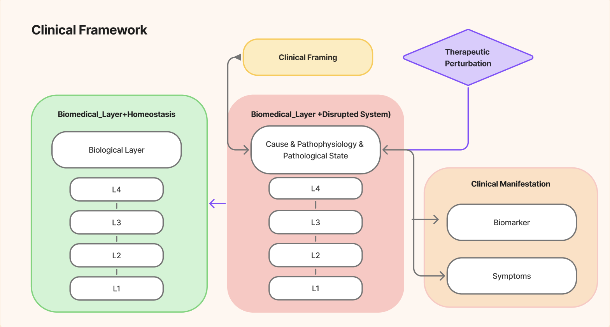
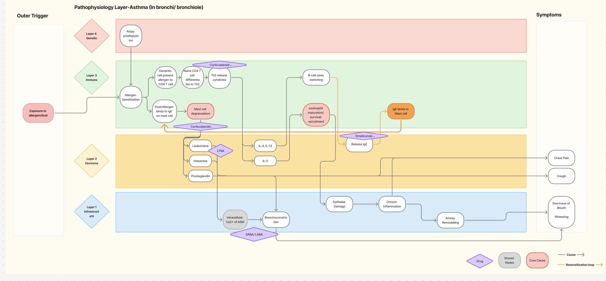

# Forest OS Ontology

A pharmacological reasoning ontology encoding 
context-specific bidirectional mediator cascades
with therapeutic effect inference.

## What This Does

Given a disease and its pathophysiological cascade,
the ontology infers:
- Which drugs suppress downstream processes
- At which biological layer each drug intervenes
- Which drugs target the immune cascade vs symptomatic relief

## Why Forest?

The body is an ecosystem — trillions of interconnected 
processes, each a branch in a living system. Health is 
the forest in balance. Disease is not a separate entity 
but a disruption of that balance, cascading through layers.

Forest OS models this directly: the same L4→L3→L2→L1 
cascade that operates in homeostasis produces disease 
when disrupted. The forest metaphor is the architecture.

## Conceptual Framework

The ontology separates five ontological modes:

**Biomedical Layer (Homeostasis)** — normal biological 
regulation across L4→L3→L2→L1 layers

**Biomedical Layer (Disrupted System)** — the same layers 
under pathological conditions. Disease is encoded as a 
deviation from homeostatic baseline, not as a separate entity.

**Clinical Framing** — human-imposed classification of 
disrupted cascades as named diseases

**Therapeutic Perturbation** — extrinsic drug interventions 
targeting specific cascade nodes

**Clinical Manifestation** — observable outputs (symptoms, 
biomarkers) produced by disrupted cascades

## Design Philosophy

Disease is modelled as a **deviation from homeostatic baseline** 
rather than as an independent entity. The same L4→L3→L2→L1 
cascade that operates in normal physiology produces disease 
when its balance is disrupted. This allows the ontology to 
represent health and disease within a single unified framework.

## Example Query

"Which drugs treat asthma, and at what layer do they act?"

Returns:
| Drug           | Layer | Target              |
|----------------|-------|---------------------|
| Corticosteroid | L3    | Bronchoconstriction |
| Omalizumab     | L3    | Bronchoconstriction |
| LTRA           | L2    | Bronchoconstriction |
| SABA/LABA      | L1    | Bronchoconstriction |

## Architecture

Four-layer biomedical model:
- L4: Genetic predisposition
- L3: Immune cascade
- L2: Hormonal/biochemical mediators
- L1: Infrastructure (organ/tissue level)

Orthogonal descriptive axes:
- By_Structural_Substrate (spatial context)
- Mediator_Profile (functional role)
- Pathological_State (disease progression)

## Research-style framing 

1. hasResponsePattern — generalised pharmacological
   directionality pattern encoding context-specific
   bidirectionality in concentration-dependent mediators

2. intervenesAtLayer — therapeutic depth scoring
   enabling layer-aware drug comparison

3. Faceted L1 infrastructure — orthogonal organ system
   × structural substrate axes with intersection classes

## Tools

- Protégé 5.6.9 (OWL 2.0.0)
- Pellet Reasoner Plug-in 2.2.0.(SWRL support)
- SQWRL query language

## Ontology Statistics
- 114 classes
- 31 object properties  
- 32 individuals
- 315 logical axioms

## Setup

1. Install [Protégé 5.6.9](https://protege.stanford.edu/)
2. Install Pellet reasoner plugin
3. Open Ontology folder
4. Open `ontology/forest_os_ontology.owx`
5. Reasoner → Pellet → Start Reasoner
6. Open SQWRLTab to run queries

## Status

- Phase 1 complete: Asthma cascade + therapeutic queries
- Phase 2 active: DL Query + SPARQL transition

## Background

Built by a 3rd year(26/27) MPharm student at University 
of Manchester exploring biomedical ontology engineering.
Pursuing SNOMED-CT certification.
