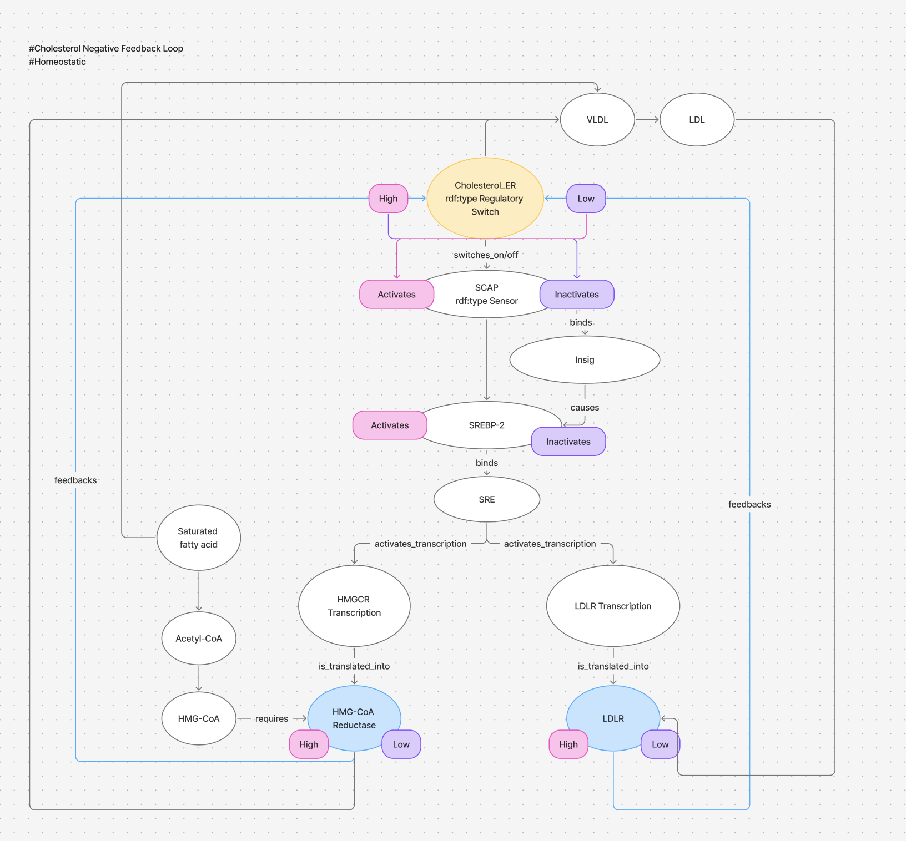
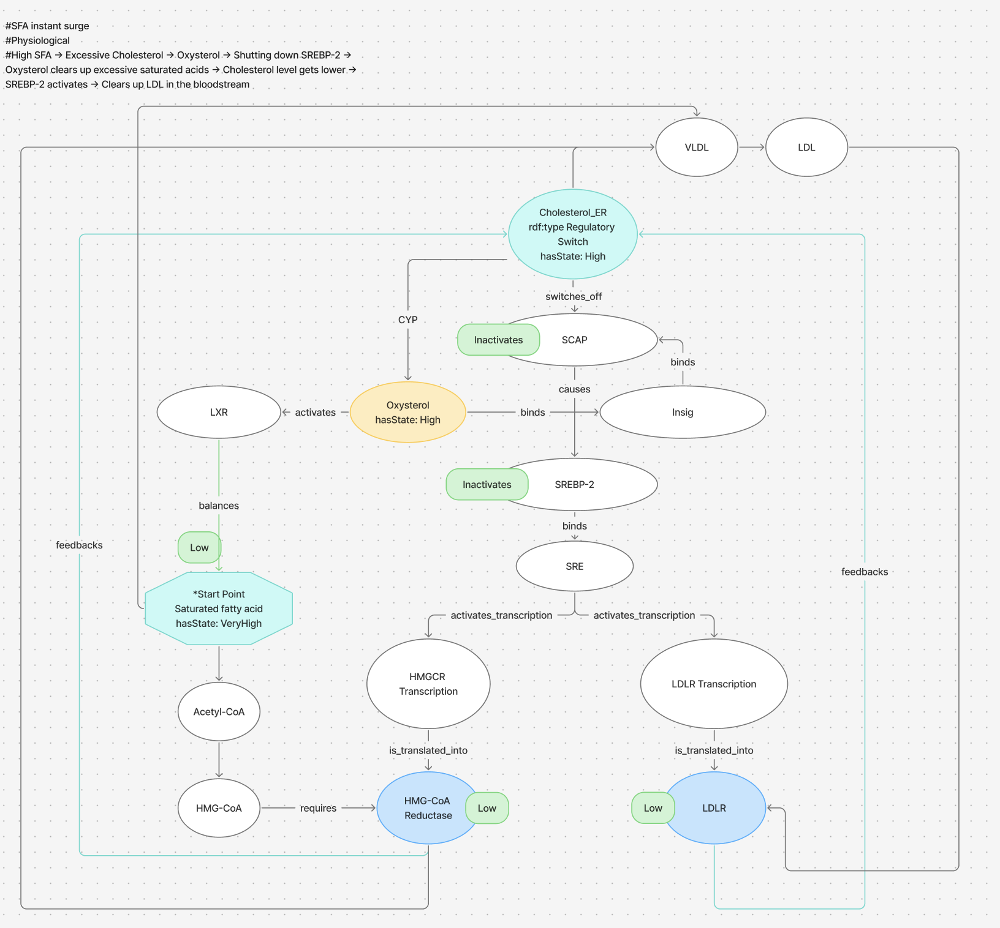
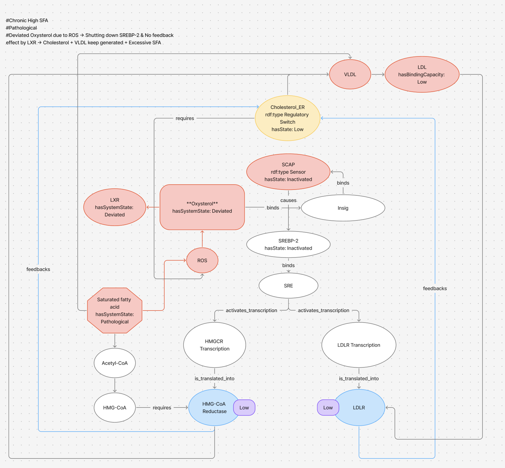
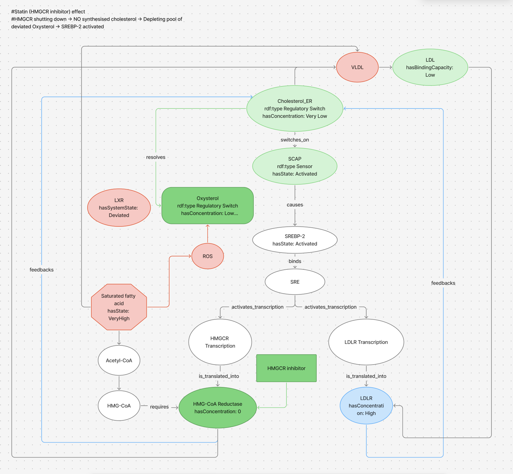

# The Four-State Model

This document expands on the state summary in the main README with full
diagrams and the SPARQL results that verify each claim. Read the README's
"Conceptual Framework" and "Four-Layer Biological Model" sections first —
this document assumes that skeleton.

---

## The States, Briefly

| State | Name | Loop | What's happening |
|---|---|---|---|
| 0 | Homeostatic | Closed | Ordinary continuous self-correction at rest |
| 1 | Physiological | Closed | Larger/acute trigger, same architecture, still resolves |
| 2 | Pathological | **Blocked** | False trigger and/or broken brake — no endogenous path back |
| 3 | Pharmacological | Closed (externally) | Drug bypasses the blocked step; root cause remains open |

States 0 and 1 are both the healthy body. State 2 is the only state where
something has actually gone wrong. State 3 is not a return to State 0/1 —
it's a different route to the same output.

---

## Case Study: Hypercholesterolaemia

### State 0 — Homeostatic

Cholesterol_ER (Regulatory_Switch) drops → Switches on SCAP (Sensor)  → 
SCAP (Sensor) activates SREBP-2 → HMGCR/LDLR transcription rises → VLDL increases/LDL cleared → 
Cholesterol_ER restored.

Cholesterol_ER High → Switches off SCAP (Sensor) → Binds Insig → Inactivates SREBP-2
→ HMGCR/LDLR transcription drops → VLDL/Cholesterol_ER decreases → Cholesterol_ER restored.



### State 1 — Physiological

Saturated fat surge → Oxysterol rises → SREBP-2 transiently shut down 
→ HMGCR/LDLR transcription drops → Normal Oxysterol activates LXR → 
SFA cleared via LXR → Oxysterol falls → SREBP-2 reactivates → LDL cleared.

Two-phase resolution, but it resolves — LXR is the balancing mechanism that
closes the loop.



### State 2 — Pathological

Chronic high SFA → ROS-driven Oxysterol → overrides SREBP-2 via Insig regardless of
what SCAP correctly senses (false trigger). LXR's balancing response no
longer clears the deviation (ROS-driven Oxysterol cannot activate LXR normally) 
— VLDL and cholesterol keep being generated by baseline activity of HMGCR. Due to low LDLR transcription, LDL remains in the bloodstream. 



### State 3 — Pharmacological

Statin inhibits HMG-CoA Reductase directly, depleting the cholesterol pool
that feeds ROS-driven Oxysterol. SREBP-2 reactivates and LDL clears — without ROS or
SFA ever being addressed. The drug closes the LDL loop; the root cause
(chronic SFA / ROS) remains open.



---

## SPARQL Verification

The four diagrams above are hand-built in Protégé. The following queries
confirm the same structure holds in the asserted graph.

**Which pathological nodes have no pharmacological resolution?**
(`sparql/pathological_unresolved_nodes.rq`)

Saturated_Fatty_Acid, Reactive_Oxygen_Species, and Liver_X_Receptor come
back `"Unresolved"` — no downstream node in `Pharmacological` state. Statin
resolves `Oxysterol` and `LDL` but does not touch the SFA/ROS root. This
is the queryable version of "the drug closes the LDL loop; the root cause
remains open."

**Does the same node class resolve differently by state?**
(`sparql/physio_vs_patho_divergence.rq`)

`LX_Receptor` (LXR) is the clearest case: the State 1 (physiological)
instance has an outgoing `balances_to` edge. The State 2
(pathological) instance of the *same class* has no such edge. This shows
why State 2 is a `Blocked loop` and where it diverges from the physiological state.

Full query definitions and result tables: [`sparql/README.md`](../sparql/README.md).

---

## Reference Case: Myocardial Infarction

MI was the first disease mapped and remains useful as a comparison case —
it shows the same 4-state pattern with two simultaneous corruptions rather
than one.

```
HEALTHY RESPONSE:
  Injury → endothelial damage → collagen/vWF exposure + temporary
  NO/PGI2/CD39 suppression → platelet activation → clot → haemostasis →
  repair → regulators restored. Loop closed.

MI DEVIATION — two simultaneous corruptions:
  Corruption 1 (false trigger):
    Plaque rupture --mimics--> injury signal. Collagen/vWF exposed, no
    actual wound.
  Corruption 2 (broken brake):
    Atherosclerosis --chronically suppresses--> endothelial function.
    NO/PGI2/CD39 absent, platelet activation unchecked.
  → Blood clot in coronary artery → Vascular blockage → ischaemia → no repair
  target, no resolution.
  Corruption 3 (feedback loop):
    Ischaemia --mimics--> Hypoxia → SNS unregulated → heart rate/
    vasoconstriction --deviates_into--> Ischaemia.
```

| Drug | Mechanism | Corruption targeted |
|---|---|---|
| Bisoprolol | Binds beta1 receptors | Lowers oxygen demand via heart rate |
| Statin | Inhibits HMG-CoA reductase | Prevents Corruption 1 (false trigger) |
| Aspirin | COX-1 inhibition → ↓TXA2 | Dampens amplification within deviation |
